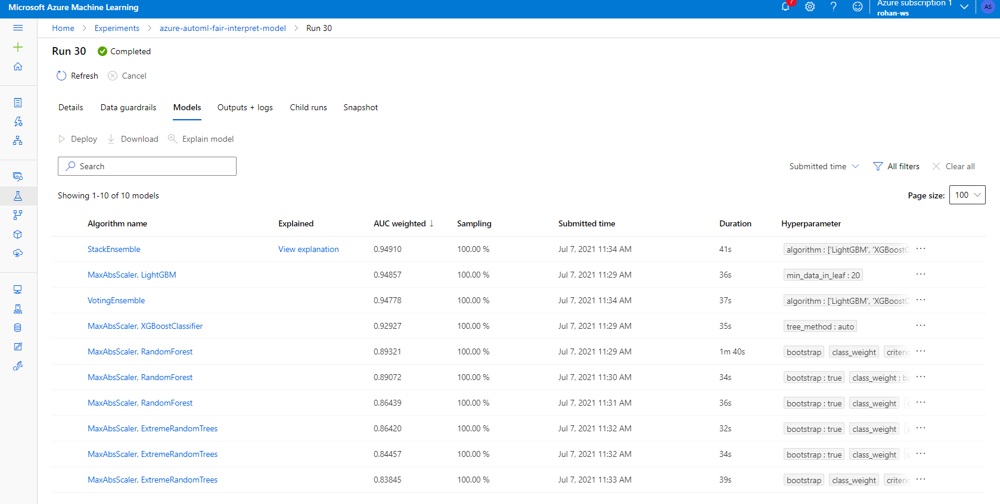
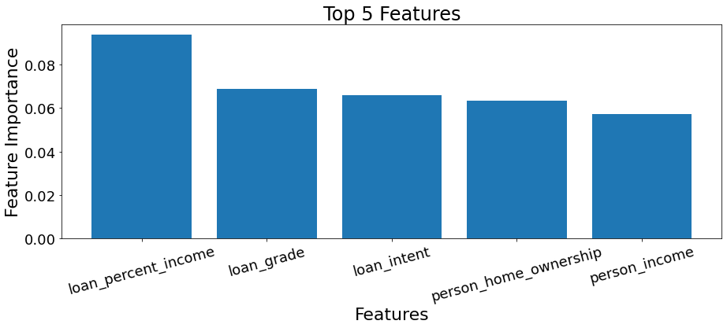

### Training a Automated Credit Risk Model and Explaining Prediction using Azure SDK
A Credit Risk Model is used to decide whether to provide credit to a borrower or not. Most popular use cases for a credit risk model is while giving out loans or insurance policy. For a more detailed overview, please checkout this [link](https://en.wikipedia.org/wiki/Credit_risk). With GDPR, providing explanation of model predictions have become crucial. Hence, in this project we use Permutation feature importance (PFI) explainer to provide explanations for our credit risk model.

We create a datastore and connect it to Azure Blob Storage. We then upload the local dataset in Azure Blob and register it in the AML workspace. After that, we create a training cluster to run the AutoML Experiment. Once the cluster is created, we setup and run the AutoML experiment. The AutoML model automatically does the featurization so no pre-processing steps are required for data. After the experiment is complete, we select the best model and obtain Global feature importance values from the model using PFI Explainer.

PFI Explainer drops a feature to understand the dependency of model on the feature. Local explainations can be provided for individual test cases as required on the time of prediction.

#### Trained Models by AutoML

---

---

#### Global Explaination

---

#### Dataset
In this project, we use the [Credit Risk Dataset](https://www.kaggle.com/laotse/credit-risk-dataset) from Kaggle.

| **Feature Name**           | **Description**                                 |
|------------------------|---------------------------------------------|
| person_age             | Age                                         |
| person_income          | Annual Income                               |
| personhomeownership    | Home ownership                              |
| personemplength        | Employment length (in years)                |
| loan_intent            | Loan intent                                 |
| loan_grade             | Loan grade                                  |
| loan_amnt              | Loan amount                                 |
| loanintrate            | Interest rate                               |
| loan_status            | Loan status (0 is non default 1 is default) |
| loanpercentincome      | Percent income                              |
| cbpersondefaultonfile  | Historical default                          |
| cbpresoncredhistlength | Credit history length                       |

#### Environment
The notebook is run in AzureML Studio on development VM. Training is done on a training cluster with 2 nodes and DS11v2 type. We use the Azure ML SDK and Azure Interpret ML package to explain the global feature importances.

